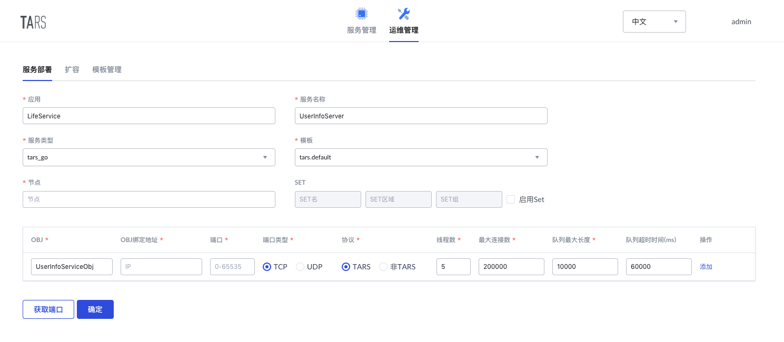

# UserInfoServer
[English Version](README_en.md)

大学生活服务平台-用户信息服务，提供用户注册，信息获取

服务接口可查看[接口文档](docs/RPC.md)
## 项目结构
```sh
UserInfoServer
├── client                  # 默认自动生成的客户端代码
│   ├── client.go
│   └── CMakeLists.txt
├── CMakeLists.txt          # 项目构建makefile文件
├── config.conf             # 默认配置文件
├── debugtool
│   └── dumpstack.go        # 默认自动生成的debug代码
├── docs                    # 文档资源
├── go.mod                  # Go modules 文件
├── go.sum
├── README.md
├── start.sh                # 默认启动脚本
├── main.go                 # 服务实现文件
├── userinfoservice_imp.go  # 接口实现文件
├── DataService.tars        # 数据服务tars文件
├── ServerStatus.tars       # 服务状态tars文件
├── UserInfoService.tars    # 用户信息服务tars文件
└── tars-protocol
    └── LifeService         # tars协议文件生成的go代码
```

## 开发环境
* Go >= `1.13.x`, 参照 [Go 官网安装文档](https://golang.org/doc/install)即可
* TarsGo, 参照[TarsGo文档](https://github.com/TarsCloud/TarsGo/blob/master/README.zh.md#%E5%AE%89%E8%A3%85)中的步骤，安装 TarsGo 即可

## 构建方式

我们将项目 clone 到任意目录下

```sh
git clone https://github.com/TarsDemo/Tars-MiniProgramm-Service-UserInfoServer.git UserInfoServer
```

进入服务目录, 生成服务发布包

```sh
cd UserInfoServer
mkdir build
cd build
cmake ..
make 
make UserInfoServer-tar
```

## 服务部署
### 部署信息

在 `Tars平台->运维管理->服务部署` 中，按如下信息部署服务，其中节点填写自己需要部署服务的节点

* 服务基本信息：
    * 应用名称：`LifeService`
    * 服务名称：`UserInfoServer`
    * 服务类型：`tars_go`
    * 模板名称：`tars.go.default`
* Obj部署信息：
    * OBJ名称：`UserInfoServiceObj`
    * 协议类型：`TARS`
    * 端口：自动生成



### 服务发布

在 `TarsWeb 平台->服务管理->LifeService->UserInfoServer->发布管理` 中，
* 选中刚刚部署的节点，点击 `发布选中节点`
* 上传发布包，选中构建项目生成的发布包 `UserInfoServer.tgz``上传
* 在发布版本中便可以找到刚刚上传的发布包并选择
* 点击 `发布` 即可完成发布
